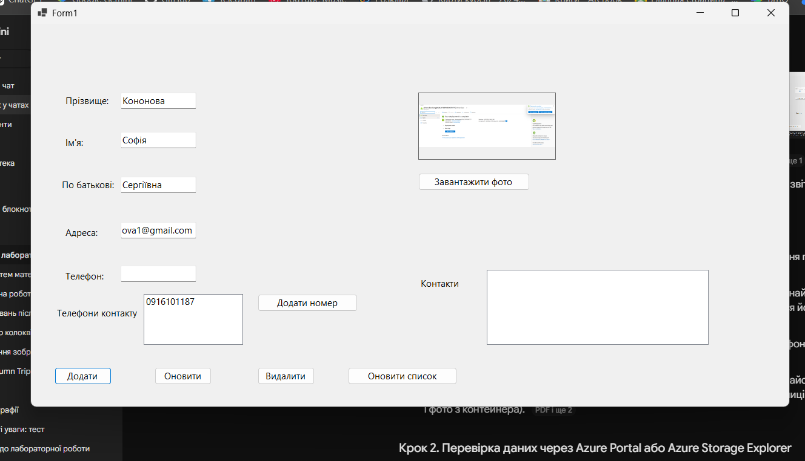
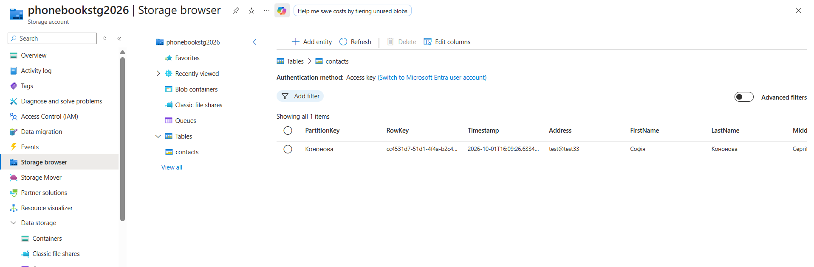
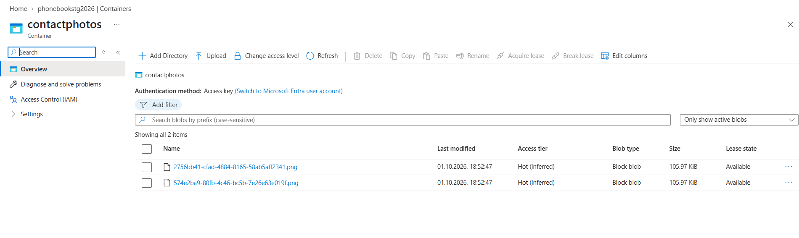

# Lab 3: Phone Book on Azure Storage

A Windows Forms application (C#, .NET) that stores contacts in the Microsoft Azure cloud:

- **Azure Table Storage** holds the text data of a contact (last name, first name, middle name, address, phone numbers, link to the photo).
- **Azure Blob Storage** holds the photo files.

> The application interface (labels and messages) is in Ukrainian.

## Features

- Add, edit and delete contacts
- Multiple phone numbers per contact
- Upload a contact photo and display it in the form
- Consistent deletion: the photo is removed from Blob Storage first, then the record from the table
- Refresh the list from the cloud with the "Refresh" button

## Screenshots

### Main form



### `contacts` table in Azure Table Storage



### `contactphotos` container in Azure Blob Storage



## Project structure

| Part | Location | Purpose |
|---|---|---|
| User interface | `Form1.cs`, `Form1.Designer.cs` | Fields, buttons, event handlers |
| Table access | `Services/ContactTableService.cs` | Add, read, update and delete records |
| Blob access | `Services/ContactPhotoService.cs` | Upload and delete photos |
| Data model | `Models/ContactEntity.cs` | Contact entity for Table Storage |

### How the two services are linked

The two Azure services are independent, so the application links them itself:

- The contact's GUID is both the `RowKey` of the table record and the beginning of the blob (file) name.
- The blob URL is stored in the `PhotoUrl` property of the table record.
- `PartitionKey` is the contact's last name.

### Deleting a contact

1. The photo is deleted from Blob Storage using the contact's GUID.
2. The record is deleted from Table Storage using `PartitionKey` + `RowKey`.

This order guarantees that no table record is left pointing to a photo that no longer exists.

## NuGet packages

| Package | Main types |
|---|---|
| `Azure.Data.Tables` | `TableClient`, `ITableEntity` |
| `Azure.Storage.Blobs` | `BlobServiceClient`, `BlobContainerClient`, `BlobClient` |

## Requirements

- Windows
- Visual Studio 2022 with the ".NET desktop development" workload
- An Azure account (a free or Azure for Students account is enough) and a Storage account

## Azure setup

1. In the Azure Portal, create a **Storage account** (Standard performance, any region).
2. Open **Security + networking → Access keys** and copy the **Connection string** of key1.
3. The `contacts` table and the `contactphotos` container are created automatically by the application on first launch.
4. To display photos in the form, the container must allow public read access:
   - In the Storage account, open **Configuration** and enable **Allow Blob anonymous access**.
   - Open the `contactphotos` container → **Change access level** → **Blob (anonymous read access for blobs only)**.

## Connection string

The connection string contains an access key, so it is **never stored in the code or committed to the repository**. The application reads it from the `AZURE_STORAGE_CONNECTION` environment variable.

Run in PowerShell, replacing the value with your own connection string:

```powershell
setx AZURE_STORAGE_CONNECTION "DefaultEndpointsProtocol=https;AccountName=...;AccountKey=...;EndpointSuffix=core.windows.net"
```

Then **close and reopen Visual Studio completely**, otherwise it will not see the new variable.
If the variable is not set, the application shows a message and exits.

## Running the application

1. Clone the repository:
   ```bash
   git clone https://github.com/x-sof-x/cloud-labs.git
   ```
2. Open `lab3-azure-storage/labCloud№3.sln` in Visual Studio.
3. Set the `AZURE_STORAGE_CONNECTION` variable (see above).
4. Press **F5**. NuGet packages are restored automatically.
5. Enter a last name and first name, optionally add phone numbers and a photo, and click "Add".

## Verifying the result

Use **Azure Storage Explorer** or Azure Portal → Storage browser. The `contacts` table contains the records, and the `contactphotos` container contains the photo files.

## Limitations

- The last name is the `PartitionKey`, so it cannot be changed after a contact is created.
- Phone numbers are stored as a single `;`-separated string, so `;` cannot be used inside a number.
- There are no transactions across Table Storage and Blob Storage; consistency is ensured by the order of operations in the application.

## Cleanup

After the lab is graded, delete the resource group in the Azure Portal to avoid charges and to leave no active access keys.

## Author

Sofia Kononova, GitHub: [@x-sof-x](https://github.com/x-sof-x)